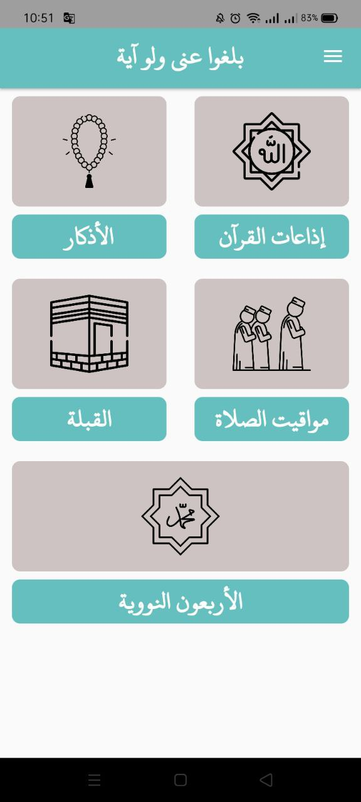
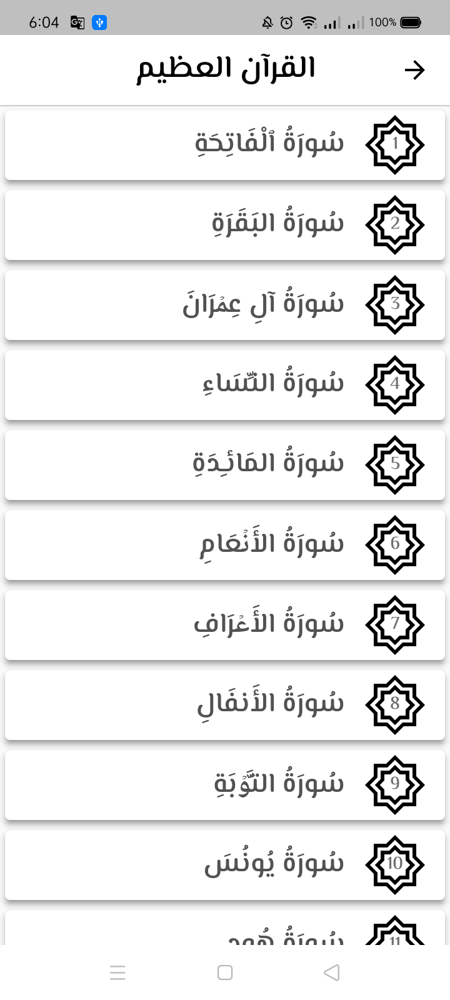
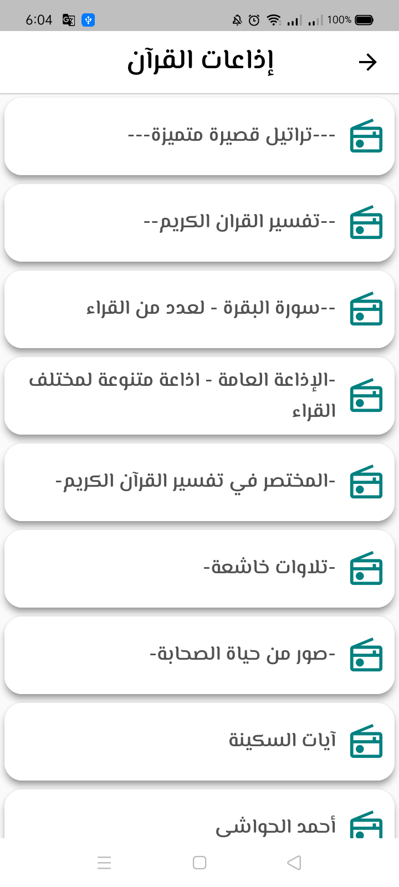
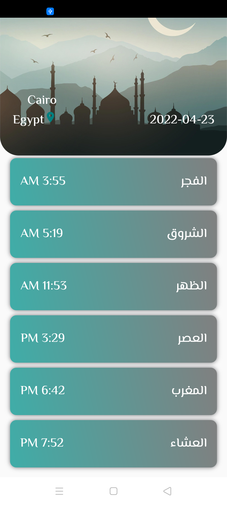
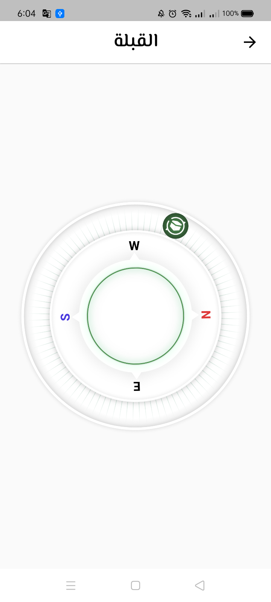
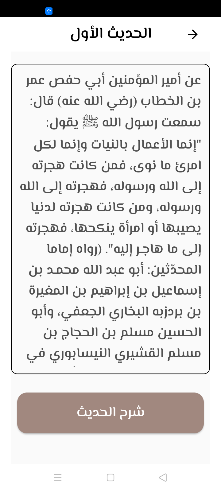

<div align="center">


# تطبيق بلغوا عني ولو آية

[](https://github.com/Muhammed-Ayad/Balgho-Convey-App)
[](https://play.google.com/store/apps/details?id=com.convey.ayah.mohamed.ayad)

يحتوي التطبيق علي القرآن الكريم واذاعات القران واذكار الصباح والمساء وبعض الادعية الذي يحتاجها المسلم في حياته وايضا مواقيت الصلاة واتجاه القبلة وكتاب الاربعون النووية
The application contains the Noble Qur’an, Qur’an radio stations, morning and evening remembrances, and some supplications that a Muslim needs in his life, as well as prayer times, the direction of the qiblah, and the Forty-Nawawi book
[](https://play.google.com/store/apps/details?id=com.convey.ayah.mohamed.ayad)

```
قال رسول الله صلى الله عليه وسلم

بَلِّغُوا عَنِّي ولو آيَةً، وَحَدِّثُوا عن بَنِي إِسْرَائِيلَ وَلَا حَرَجَ، وَمَن كَذَبَ عَلَيَّ مُتَعَمِّدًا، فَلْيَتَبَوَّأْ مَقْعَدَهُ مِنَ النَّارِ.

الراوي : عبدالله بن عمرو | المحدث : البخاري | المصدر : صحيح البخاري
الصفحة أو الرقم: 3461 | خلاصة حكم المحدث : [صحيح] |
```










<div align="left">


## :sparkles: Features:

- Noble Qur’an
- Qur’an radio stations
- Morning and evening remembrances
- the Forty-Nawawi book
- Prayer Times
- Qibla Direction
- Notification for Elazkar

## :soon: New Features and Bugs will be fixed on the next update:

- [ ] Update splash screen
- [ ] Update app Logo and icon
- [ ] Early Notification for prayer times
- [ ] Names of Allah
- [ ] Counter
- [ ] Zakat Calculator
- [ ] Light & Dark Themes
- [ ] Dhikr after prayer
- [ ] Large set of downloadable Sounds (Adhan, Du'a etc.)

🔗 Resources :

## Quran

### http://api.alquran.cloud/v1/quran/quran-uthmani

## Radios

### https://www.mp3quran.net/api/radio/radio_ar.json

## Azkar

### https://github.com/osamayy/azkar-db/blob/master/azkar.json

## Nawawi

### https://github.com/osamayy/40-hadith-nawawi-db/blob/main/40-hadith-nawawi.json

## License

MIT License

Copyright (c) 2023 https://github.com/Muhammed-Ayad and https://github.com/salamaEnigma

Permission is hereby granted, free of charge, to any person obtaining a copy of this software and associated documentation files (the "Software"), to deal in the Software without restriction, including without limitation the rights to use, copy, modify, merge, publish, distribute, sublicense, and/or sell copies of the Software, and to permit persons to whom the Software is furnished to do so, subject to the following conditions:

The above copyright notice and this permission notice shall be included in all copies or substantial portions of the Software.

THE SOFTWARE IS PROVIDED "AS IS", WITHOUT WARRANTY OF ANY KIND, EXPRESS OR IMPLIED, INCLUDING BUT NOT LIMITED TO THE WARRANTIES OF MERCHANTABILITY, FITNESS FOR A PARTICULAR PURPOSE AND NONINFRINGEMENT. IN NO EVENT SHALL THE AUTHORS OR COPYRIGHT HOLDERS BE LIABLE FOR ANY CLAIM, DAMAGES OR OTHER LIABILITY, WHETHER IN AN ACTION OF CONTRACT, TORT OR OTHERWISE, ARISING FROM, OUT OF OR IN CONNECTION WITH THE SOFTWARE OR THE USE OR OTHER DEALINGS IN THE SOFTWARE.
